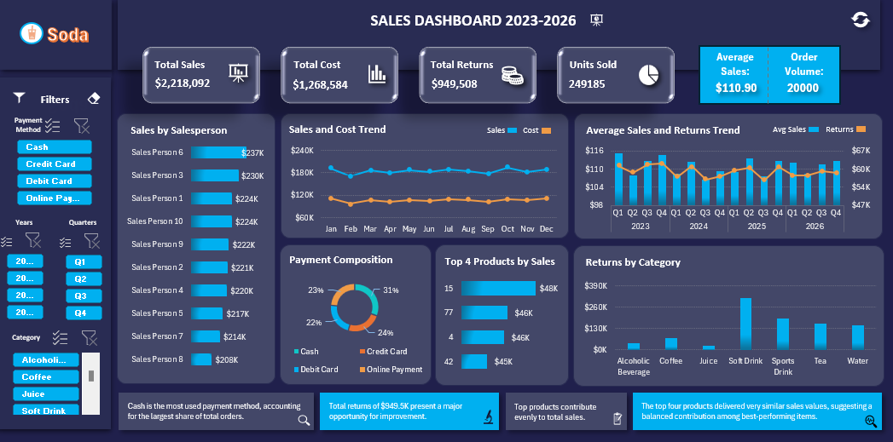

# 📊 Sales Data Analytics Dashboard

> **Professional Excel-based Sales Analytics Project** – A comprehensive **Data Analytics** solution for tracking, analyzing, and visualizing sales performance, costs, returns, and trends using **Pivot Tables, Filters, and VBA Macros** in a single Excel workbook.

---

## 📌 **About the Project**

This project is part of the **Data Analytics** initiative in the **Sales** section. It provides a **centralized, interactive Excel dashboard** to monitor key sales metrics, enabling data-driven decision-making.

- **Data Source**: Consolidated sales data (orders, products, customers, salespersons, categories, payment methods, dates, quantities, costs, and returns).
- **Tool**: Microsoft Excel (Pivot Tables, Slicers, Charts, Conditional Formatting, and VBA Macros).
- **Output**: A dynamic **Sales Dashboard** with real-time filtering and visualization capabilities.

---

## ✨ **Features**
   Feature | Description |
 |--------|-------------|
 | **Interactive Dashboard** | Real-time visual representation of sales, costs, returns, and trends. |
 | **Pivot Tables** | Aggregated summaries of sales by person, product, category, payment method, and time. |
 | **Dynamic Filters (Slicers)** | Filter data by year, quarter, category, payment method, and salesperson. |
 | **Trend Analysis** | Visualize sales and cost trends over time (monthly/quarterly). |
 | **Top Performers** | Identify top salespersons, products, and categories. |
 | **Return Tracking** | Monitor returns by category and their impact on revenue. |
 | **Payment Method Breakdown** | Analyze revenue distribution across payment channels. |
 | **VBA Macros** | Automate data updates and filter management. |

---

## 🛠️ **Technologies & Tools**

- **Microsoft Excel** – Core platform for data storage, processing, and visualization.
- **Pivot Tables & Pivot Charts** – Aggregation and dynamic reporting.
- **Slicers** – Interactive filtering.
- **Conditional Formatting** – Highlighting key insights.
- **VBA Macros** – Automation for:
  - **Data Refresh**: Update all pivot tables and charts with new data.
  - **Filter Management**: Clear or apply predefined filter sets.
- **Data Validation** – Ensures consistency in categories, payment methods, and dates.

---

## 📁 **Project Structure**


Sales-Analytics-Dashboard/
│
├── Excel-dashboard.png          # Screenshot of the dashboard
├── Sales_Data_Analytics.xlsx    # Main Excel file (data + dashboard)
└── README.md                    # Project documentation (this file)


> ✅ **Note**: The **entire project** (raw data, pivot tables, charts, and dashboard) is contained in a **single Excel file** for ease of use and distribution.

---

## 🚀 **How to Use**

### 1. **Open the Excel File**
- Open `Sales_Data_Analytics.xlsx` in Microsoft Excel (Macros must be enabled).

### 2. **Enable Macros**
- If prompted, **enable macros** to allow automation scripts to run.
- Go to **File > Options > Trust Center > Trust Center Settings > Macro Settings** and select **"Enable all macros"**.

### 3. **Explore the Dashboard**
- Navigate to the **Dashboard** sheet.
- Use **slicers** on the left to filter by:
  - Year / Quarter
  - Category
  - Payment Method
  - Salesperson
- All charts and tables update **automatically** based on selected filters.

### 4. **Update Data**
- Paste new sales data into the **Fact_table** sheet (ensure format consistency).
- Run the **"Refresh All"** macro (or press `Alt + F8`, select `RefreshAllData`, and click **Run**) to update all pivot tables and charts.

### 5. **Clear Filters**
- Use the **"Clear All Filters"** macro to reset all slicers to default (all items selected).

---

## 📈 **Dashboard Overview**



### **Key Metrics Displayed**
| Metric | Description |
|-------|-------------|
| **Total Sales** | Gross revenue from all orders. |
| **Total Cost** | Total cost of goods sold. |
| **Total Returns** | Total value of returned items. |
| **Units Sold** | Total quantity of products sold. |
| **Average Sales** | Average order value. |
| **Order Volume** | Total number of orders processed. |

### **Visualizations**
- **Sales by Salesperson** – Bar chart ranking sales performance.
- **Sales and Cost Trend** – Line chart showing monthly sales vs. cost.
- **Average Sales and Returns Trend** – Dual-axis chart tracking average sales and return values over time.
- **Payment Composition** – Donut chart of payment method distribution.
- **Top 4 Products by Sales** – Horizontal bar chart of best-selling products.
- **Returns by Category** – Bar chart showing return values per product category.

---

## 🔗 **Data Relationships Diagram**

```mermaid
erDiagram
    FACT_TABLE ||--o{ PRODUCT : ""
    FACT_TABLE ||--o{ SALESPERSON : ""
    FACT_TABLE ||--o{ CUSTOMER : ""
    FACT_TABLE ||--o{ CATEGORY : ""
    FACT_TABLE ||--o{ PAYMENT_METHOD : ""
    PRODUCT ||--o{ CATEGORY : ""

    FACT_TABLE {
        int OrderID PK
        int ProductID FK
        int CustomerID FK
        int SalesPersonID FK
        int QuantitySold
        string PaymentMethod FK
        int QuantityReturned
        date OrderDate
        decimal Sales
        decimal Cost
        decimal Returns
    }

    PRODUCT {
        int ProductID PK
        string ProductName
        string Category FK
        decimal SalesPrice
        decimal CostPrice
    }

    SALESPERSON {
        int SalesPersonID PK
        string Name
    }

    CUSTOMER {
        int CustomerID PK
    }

    CATEGORY {
        string Category PK
    }

    PAYMENT_METHOD {
        string Method PK
    }


🧩 Macros Included


  
    
      Macro Name
      Purpose
    
  
  
    
      RefreshAllData
      Refreshes all pivot tables, charts, and slicers with updated data.
    
    
      ClearAllFilters
      Resets all slicers to show all data (no filters applied).
    
    
      UpdateDashboard
      Recalculates all formulas and updates dashboard visuals.
    
  


🔐 Security Note: Macros are used solely for automation within the workbook. Always review macro code before enabling if received from untrusted sources.


📊 Insights & Use Cases

Performance Tracking: Identify top-performing salespersons and products.
Cost Management: Monitor cost trends and their impact on profitability.
Return Analysis: Detect categories or products with high return rates.
Payment Preferences: Understand customer payment behavior.
Time-Based Trends: Analyze seasonal or quarterly sales patterns.

📥 How to Contribute

Fork the repository.
Clone your fork locally.
Update the Excel file with new data or improvements.
Commit your changes with clear messages.
Push to your fork and submit a Pull Request.

⚠️ Ensure all macros are tested and data formats remain consistent.


📞 Support & Contact
For questions, suggestions, or issues related to this project:

Open an Issue in the GitHub repository.
Refer to the Data Analytics section in Notion (Sales) for additional context and updates.

📜 License
This project is intended for internal use within the Data Analytics team. Distribution outside the organization requires prior approval.


✅ Built with Excel | 📊 Powered by Data | 🚀 Driven by Insights


